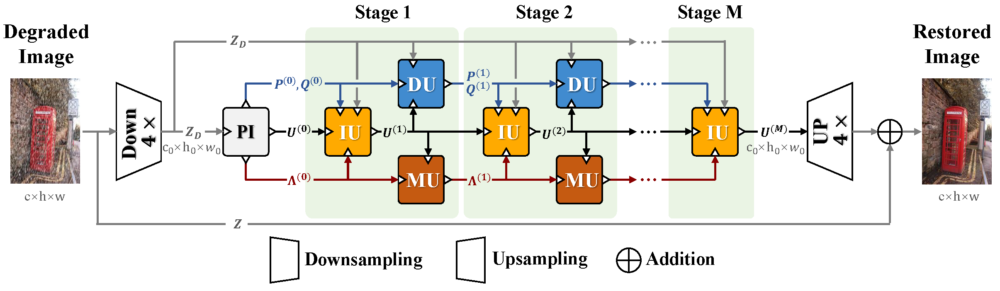
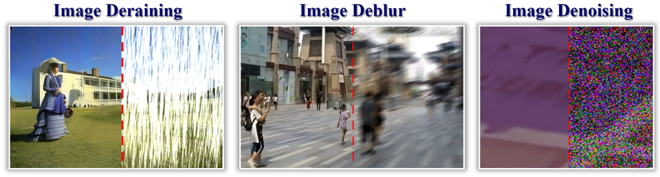

# DeepSN-Net: Deep Semi-smooth Newton Driven Network for Blind Image Restoration

The official pytorch implementation of the paper:

[DeepSN-Net: Deep Semi-smooth Newton Driven Network for Blind Image Restoration (TPAMI, 2025)](https://ieeexplore.ieee.org/abstract/document/10820096) 

**Xin Deng**, **Chenxiao Zhang**, **Lai Jiang**, **Jingyuan Xia**, **Mai Xu**



:star: If DeepSN-Net is helpful to your projects, please help star this repo. Thanks! :hugs:

## News
- **2024.05.21**: Release the pre-trained weights.
- **2025.01.03**: Release the project code.
- **2025.06.27**: Supplement README document.


## Demo on Image restoration


We also introduced a **lightweight version** for high-efficient image restoration in conditions with limited computing resources. 

Please refer to our [paper](https://ieeexplore.ieee.org/abstract/document/10820096) for details.

## Dependencies and Installation
- CUDA == 12.8
- Pytorch == 2.0.1
```
# git clone this repository
git clone git@github.com:pandazcx/DeepSN-Net.git
cd DeepSN-Net

# Create a conda environment and activate it
conda env create --file environment.yaml
conda activate deepsnnet
```

## Examples
Specify the model version to use in the `config.yml` for different tasks. 

`Version: DeepSN_Net` is the default model, `Version: DeepSN_Net_s` refers to the lightweight model.
### 1. Train
[Download the pretrained models](https://drive.google.com/drive/folders/1MB_NhlFmuTo7UDaCgaqaTVdmJBr9Q2Rm?usp=sharing) and place them in the `Pretrained` folder.
#### 1.1 Image Deraining
Modify the paths to the training and testing datasets in the [config.yml](https://github.com/pandazcx/DeepSN-Net/blob/main/Derain/config.yml)

- Train from scratch
```
cd Derain
python main.py -r 
```
- Finetune
```
cd Denoise
python main.py -r -p Pretrained/DeepSN_Net_derain.pth 
```

#### 1.2 Image Denoising
Modify the paths to the training and testing datasets in the [config.yml](https://github.com/pandazcx/DeepSN-Net/blob/main/Denoise/config.yml)

- Train from scratch
```
cd Denoise
python main.py -r 
```
- Finetune
```
cd Denoise
python main.py -r -p Pretrained/DeepSN_Net_denoise.pth 
```

#### 1.3 Image Deblur
Modify the paths to the training and testing datasets in the [config.yml](https://github.com/pandazcx/DeepSN-Net/blob/main/Deblur/config.yml)

- Train from scratch
```
cd Deblur
python main.py -r 
```
- Finetune
```
cd Deblur
python main.py -r -p Pretrained/DeepSN_Net_deblur.pth 
```

### 2. Test
#### 2.1 Image Deraining
- Test on the testset
```
cd Derain
python main.py -r -m test -p Pretrained/DeepSN_Net_derain.pth 
```
Use the `evaluate_YCBCR_PSNR_SSIM.m` to compute PSNR and SSIM in the YCbCr color space.

- Test on a single image
```
cd Derain
python main.py -r -m single_test -p Pretrained/DeepSN_Net_derain.pth -i <image path>
```

#### 2.2 Image Denoising
- Test on realworld benchmark
```
cd Denoise
python main.py -r -m test -p Pretrained/DeepSN_Net_denoise.pth 
```
Submit the output results to the [SIDD](https://abdokamel.github.io/sidd/) and [DND](https://noise.visinf.tu-darmstadt.de/) online evaluation platforms.

- Test on a single image
```
cd Denoise
python main.py -r -m single_test -p Pretrained/DeepSN_Net_denoise.pth -i <image path>
```

#### 2.3 Image Deblur
- Test on the testset
```
cd Deblur
python main.py -r -m test -p Pretrained/DeepSN_Net_deblur.pth 
```

- Test on a single image
```
cd Deblur
python main.py -r -m single_test -p Pretrained/DeepSN_Net_deblur.pth  -i <image path>
```


### Citation
If our work is useful for your research, please consider citing:
```
@ARTICLE{10820096,
  author={Deng, Xin and Zhang, Chenxiao and Jiang, Lai and Xia, Jingyuan and Xu, Mai},
  journal={IEEE Transactions on Pattern Analysis and Machine Intelligence}, 
  title={DeepSN-Net: Deep Semi-Smooth Newton Driven Network for Blind Image Restoration}, 
  year={2025},
  volume={47},
  number={4},
  pages={2632-2646},
  doi={10.1109/TPAMI.2024.3525089}
  }
```

### Contact
If you have any questions, please feel free to reach me out at `sy2339221@buaa.edu.cn`.
